I started sorting the caps and realised that there are significantly more Alexander Keiths than anything else. Counting them while sorting was something I considered, but it was harder than you'd think. The plan is to use a scale to weigh them and avoid having to count at all.

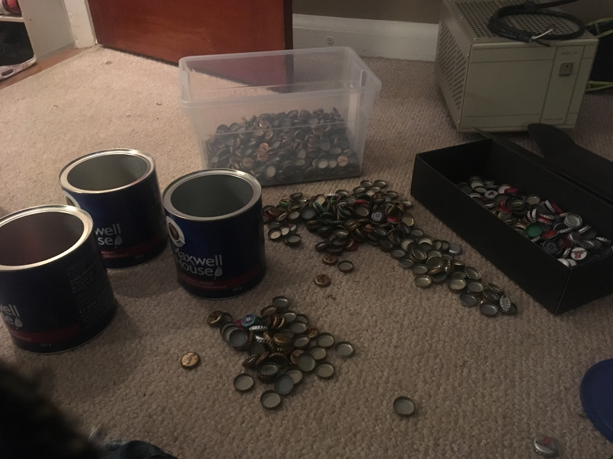

These are the main caps. The individual cropped photos can be found in the `images/caps/` directory. The two budwiser cap types are pretty similar but I decided to keep them separate just in case. Mixing them is a lot easier than re-sorting.

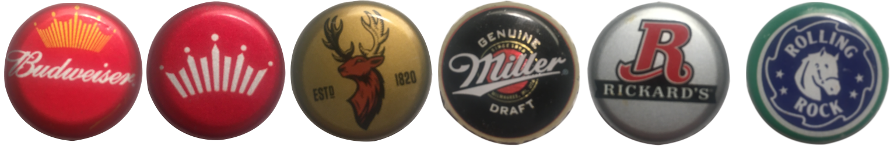

While I figure out where to find a scale, I might as well start thinking about the cap layout. The `shape` and `pattern` packages define some simple layout algorithms. This is the output of the `pattern.Grid` implementation.

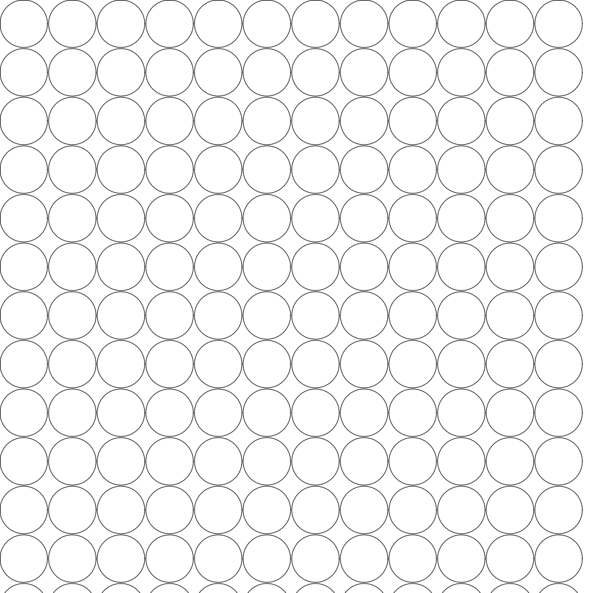

This seemed ok until I started actually arranging the caps manually. The pattern wasn't a square grid at all...

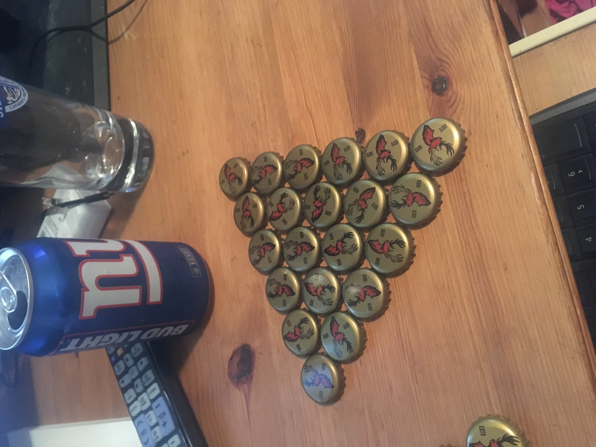

A bit of googling I found that it's called [Circle Packing](https://en.wikipedia.org/wiki/Circle_packing). A set of 3 touching caps can be viewed as an equilateral triangle with a point at the center of each cap. Each side is two times the radius of a cap so all we need is the Pythagorean Theorem for this one.

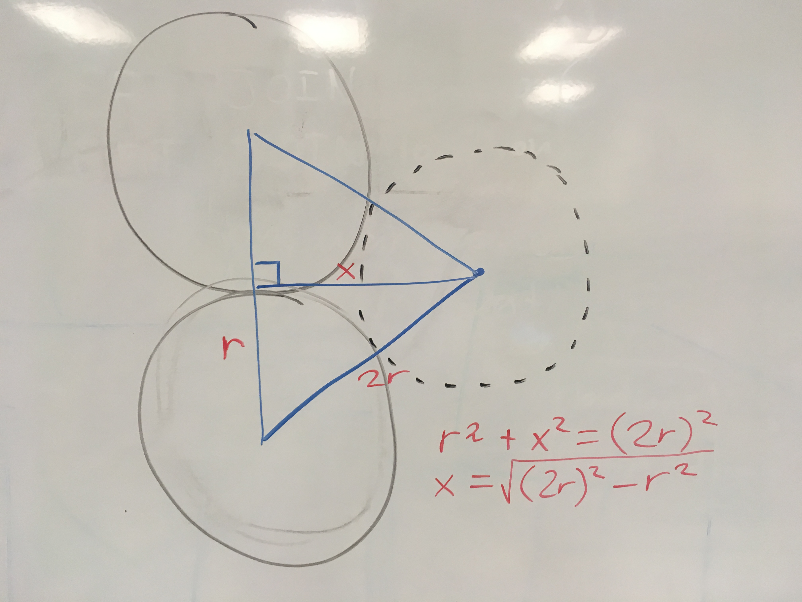
 
Based on this, I implemented `pattern.Triangular`. Here's an example of the output.

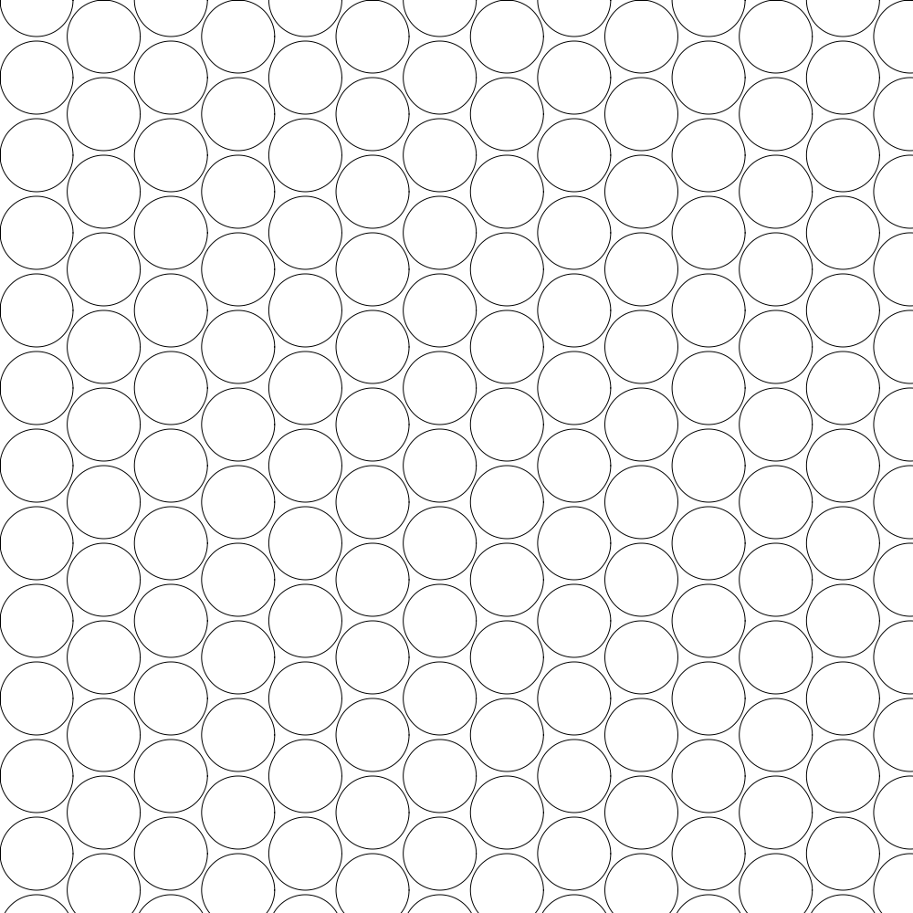

Time to see how this might actually work. This is the source image I'm working with:

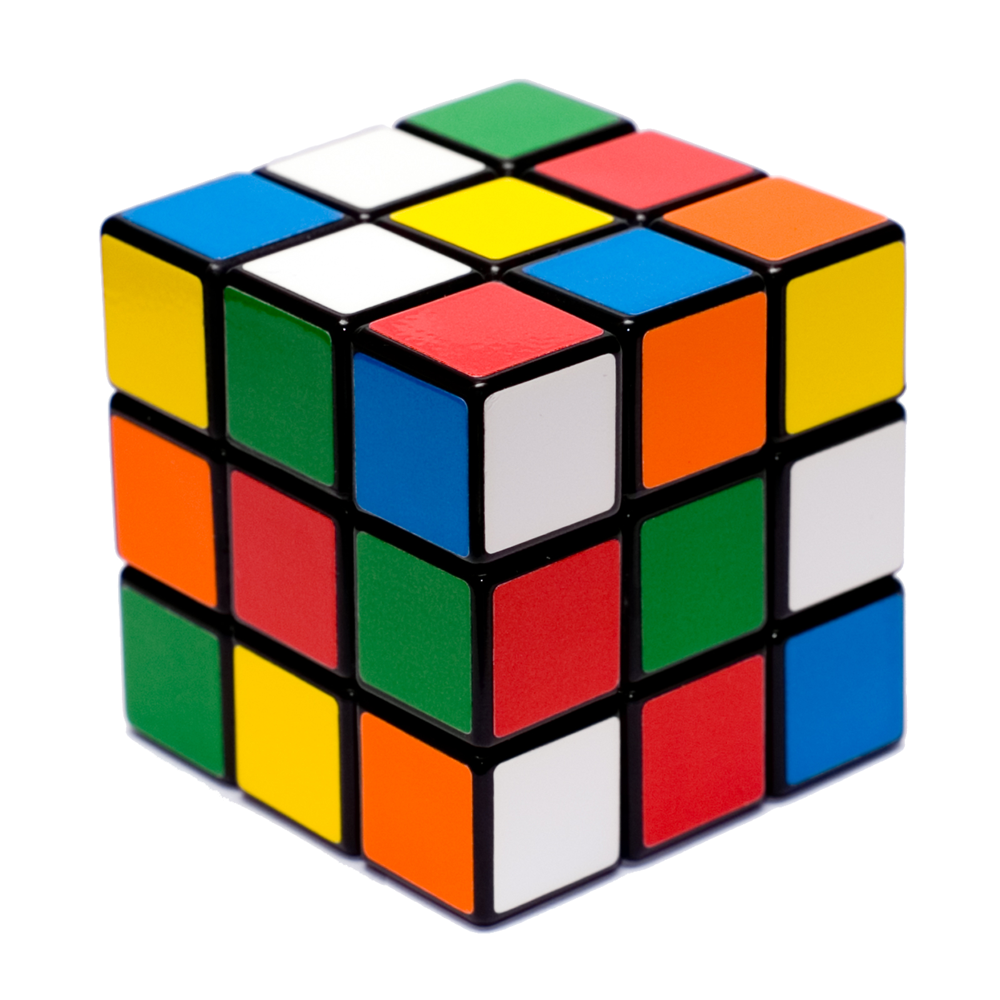

I set the circle radius to be 20 pixels which results in 1863 circles. For each circle, I am taking the bounding box and padding it with 5 additiona pixels. I'm then computing the average RGB color for that rectangle in the source image. Finally, I draw the circle with the color as the fill.

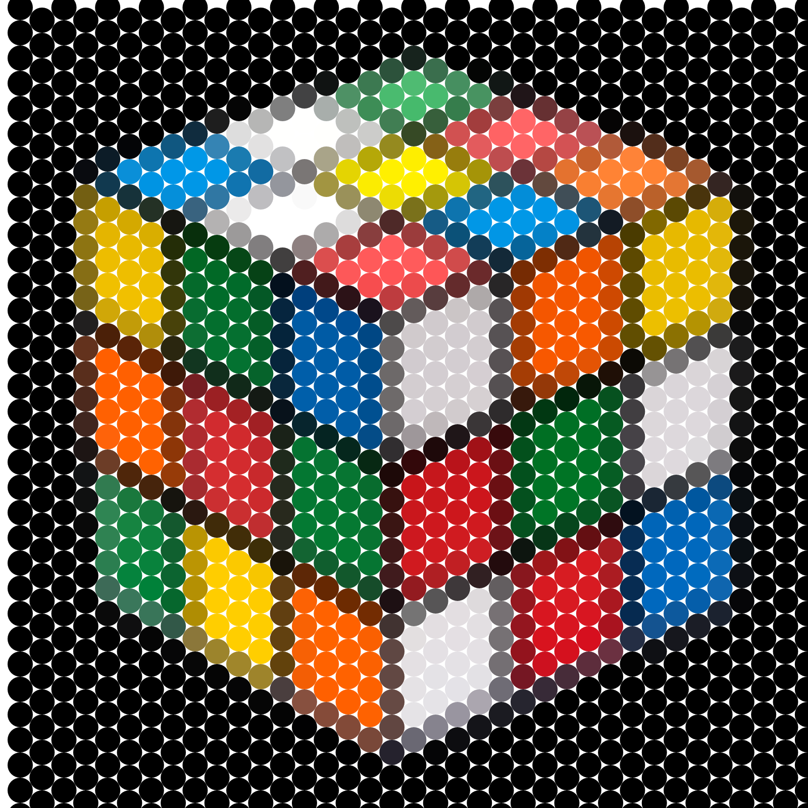

Now let's replace the circles with bottlecaps! I'm choosing a bottle cap image by comparing the circle color with the cap image's average color. The huristic is pretty simplistic: `DISTANCE = ABS(a.R - b.R) + ABS(a.G - b.G) + ABS(a.B - b.B)`.

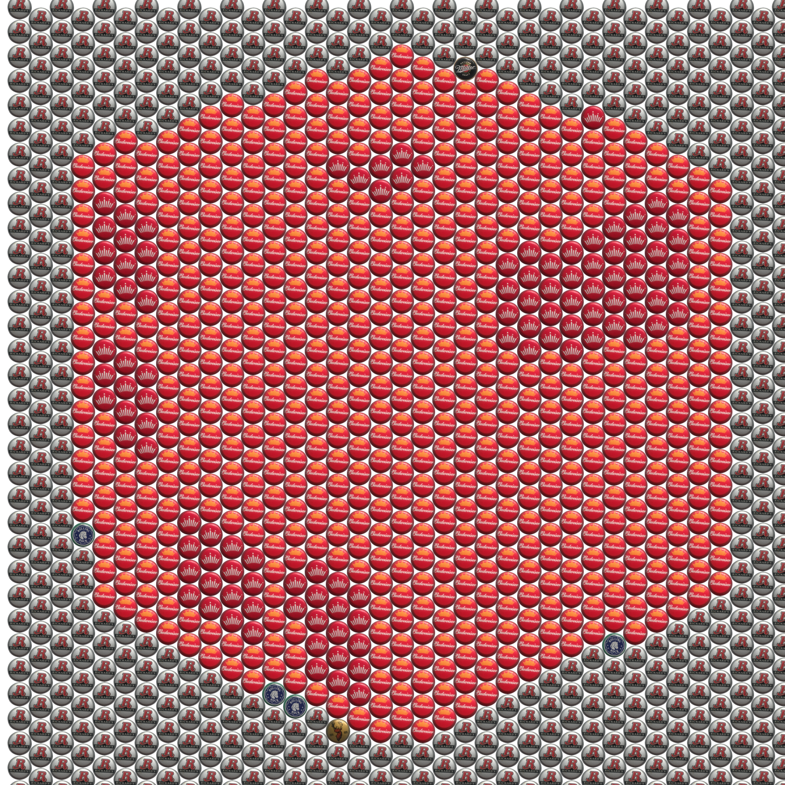

Not what we wanted ... I'm assuming the color difference function is too shitty. I found the Wikipedia page for [Color Difference](https://en.wikipedia.org/wiki/Color_difference) and it says that I should be using a weighted Euclidean distance function. That's basically what I was doing before except you square each component difference before adding and then take the square root of the sum. Since I'm just comparing them, I can skip the last step. 

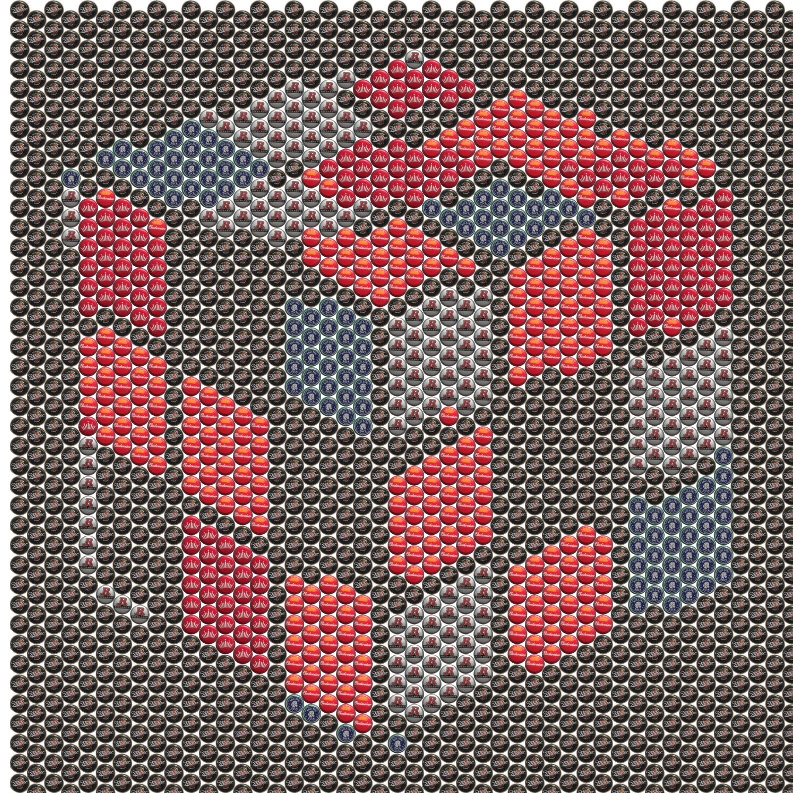

I tried a different approach to color selection. First I find N prominent colors in the image (using k-means) where N is number of cap types (in our case 6). Then I match each promiment color to a bottlecap that has a similar color (each color is only used once). This seems to produce better contrast in certain features. I also stopped drawing caps in tiles with no pixels. I'll need to figure out how to deal with those edges.

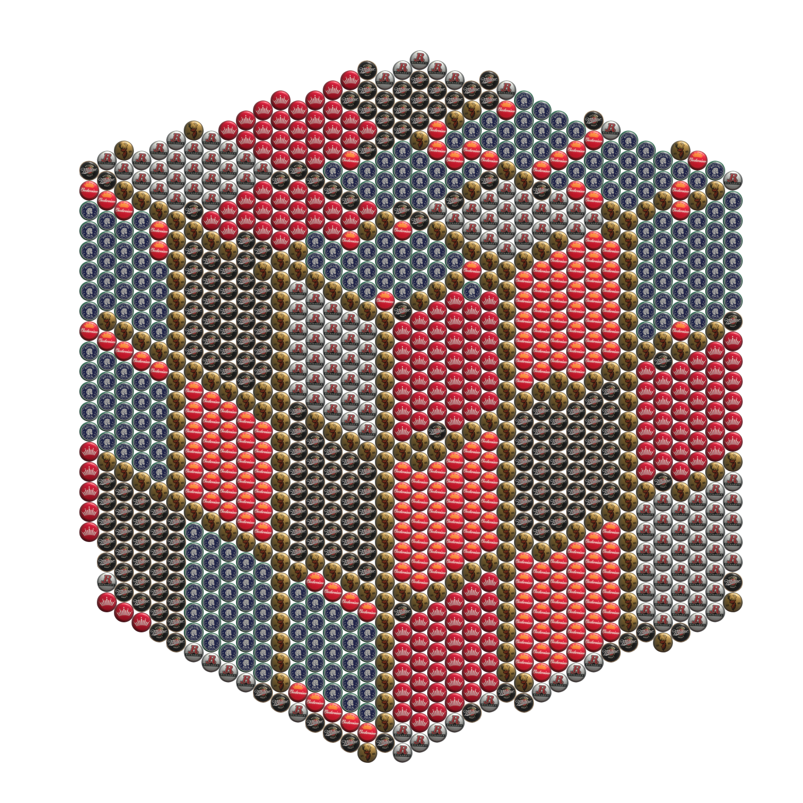

Someone threw out all the caps, so I'm not going to be working on this anymore.